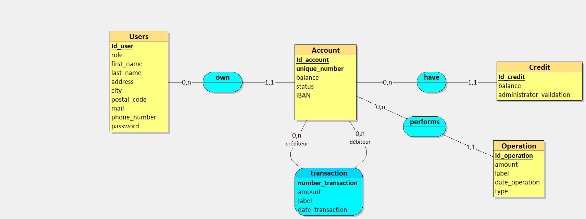

# BANK-ROUT

Vous êtes développeur junior au sein du service informatique d’une enseigne bancaire nommée Bank Root.

Le coeur de cible de cette banque était jusqu’à maintenant de proposer des services bancaires sur site.

Elle souhaite maintenant diversifier sa clientèle, entrer de plein pied dans l’ère du numérique ( kek …) et (ENFIN) proposer à ses usagers un service bancaire en ligne renouvelé afin d’attirer de nouveaux utilisateurs et moderniser son offre.

La mission de votre équipe est de concevoir une application qui permet à votre employeur la gestion de ses comptes bancaires en ligne dans un premier temps et dans un second temps de proposer des services de gestion bancaire à vos clients (dépôts, virements, etc …).

## Tables des matières

- [BANK-ROUT](#bank-rout)
  - [Tables des matières](#tables-des-matières)
  - [Instalation](#instalation)
  - [Règles métier](#règles-métier)
  - [Dictionnaire de données](#dictionnaire-de-données)
  - [MCD](#mcd)
  - [MLD](#mld)
  - [MPD](#mpd)
  - [UML](#uml)
    - [Diagrame Usecase](#diagrame-usecase)
    - [Diagrame de classe](#diagrame-de-classe)
    - [Diagrame séquentiel](#diagrame-séquentiel)

## Instalation

---

## Règles métier

**CLIENT**

- À un numéro unique
- Lecture de son compte
- Peut demander la suppression de son compte
- Peut faire un virement vers un autre compte

**COMPTE**

- Posséder par un seul client
- On peut y déposer ou retirer une somme
- Page de transaction
- À un numéro unique

**ADMIN**

- est un banquier
- Peut voir un listing de tous les comptes
- Valide la suppression d'un compte
- Valide un crédit

---

## Dictionnaire de données

| Code mnémonique          | Désignation                                           | Type | Taille | Remarque   |
| ------------------------ | ----------------------------------------------------- | ---- | ------ | ---------- |
| first_name_admin         | Prénom de l'administrateur                            | A    | 50     |            |
| last_name_admin          | nom de l'administrateur                               | A    | 50     |            |
| address_admin            | adresse de l'administrateur                           | AN   | 100    |            |
| city_admin               | ville de l'administrateur                             | A    | 50     |            |
| postale_code_admin       | code postal de l'administrateur                       | AN   | 20     |            |
| mail_admin               | mail de l'administrateur                              | AN   | 100    |            |
| phone_number_admin       | téléphone de l'administrateur                         | N    |        |            |
| password_admin           | mot de passe de l'administrateur                      | AN   | 255    |            |
| unique_number_client     | numero unique du client                               | N    |        |            |
| first_name_client        | Prénom du client                                      | A    | 50     |            |
| last_name_client         | nom du client                                         | A    | 50     |            |
| address_client           | adresse du client                                     | AN   | 100    |            |
| city_client              | ville du client                                       | A    | 50     |            |
| postale_code_client      | code postal du client                                 | AN   | 20     |            |
| mail_client              | mail du client                                        | AN   | 100    |            |
| phone_number_client      | téléphone du client                                   | N    |        |            |
| password_client          | mot de passe du client                                | AN   | 255    |            |
| balance_credit           | la somme du crédit demandé                            | N    |        |            |
| administrator_validation | booléen pour savoir si la demande est accepté ou non  | Bool |        |            |
| balance_account          | montant du solde du compte                            | N    |        |            |
| unique_number_account    | numero unqiue                                         | N    |        |            |
| status_account           | status du coumpte, 1:ouvert, 2:en attente, 3:suprimer | N    |        |            |
| iban_account             | numero unique de banque                               | AN   | 34     |            |
| amount_operation         | montant de l'operation                                | N    |        |            |
| date_operation           | date de l'operation                                   | date |        | AAAA:MM:JJ |
| amount_transaction       | montant de la transaction                             | N    |        |            |
| date_transaction         | date de la transaction                                | date |        | AAAA:MM:JJ |
| label_transaction        | motif du virement                                     | AN   | 50     |            |

---

## MCD

[](./database/MCD.jpg)

---

## MLD

[](./database/MLD.jpg)

---

## MPD

[](./database/MPD.jpg)

```sql
CREATE TABLE admin(
   id_admin COUNTER,
   first_name VARCHAR(50) NOT NULL,
   last_name VARCHAR(50) NOT NULL,
   address VARCHAR(100) NOT NULL,
   city VARCHAR(50) NOT NULL,
   postal_code VARCHAR(20) NOT NULL,
   mail VARCHAR(100) NOT NULL,
   phone_number INT NOT NULL,
   password VARCHAR(255) NOT NULL,
   PRIMARY KEY(id_admin)
);

CREATE TABLE client(
   id_client COUNTER,
   unique_number INT NOT NULL,
   first_name VARCHAR(50) NOT NULL,
   last_name VARCHAR(50) NOT NULL,
   address VARCHAR(100) NOT NULL,
   city VARCHAR(50) NOT NULL,
   postal_code VARCHAR(20) NOT NULL,
   mail VARCHAR(100) NOT NULL,
   phone_number INT NOT NULL,
   password VARCHAR(255) NOT NULL,
   id_admin INT NOT NULL,
   PRIMARY KEY(id_client),
   UNIQUE(unique_number),
   FOREIGN KEY(id_admin) REFERENCES admin(id_admin)
);

CREATE TABLE account(
   id_account COUNTER,
   unique_number INT NOT NULL,
   balance DECIMAL(15,2),
   status INT,
   iban VARCHAR(34),
   id_client INT NOT NULL,
   PRIMARY KEY(id_account),
   UNIQUE(id_client),
   UNIQUE(unique_number),
   FOREIGN KEY(id_client) REFERENCES client(id_client)
);

CREATE TABLE credit(
   id_credit COUNTER,
   balance DECIMAL(15,2) NOT NULL,
   administrator_validation LOGICAL,
   id_admin INT NOT NULL,
   id_client INT NOT NULL,
   PRIMARY KEY(id_credit),
   FOREIGN KEY(id_admin) REFERENCES admin(id_admin),
   FOREIGN KEY(id_client) REFERENCES client(id_client)
);

CREATE TABLE operation(
   id_client INT,
   id_account INT,
   amount DECIMAL(15,2) NOT NULL,
   date_operation DATE NOT NULL,
   type VARCHAR(50) NOT NULL,
   PRIMARY KEY(id_client, id_account),
   FOREIGN KEY(id_client) REFERENCES client(id_client),
   FOREIGN KEY(id_account) REFERENCES account(id_account)
);

CREATE TABLE transaction(
   id_account_crediteur INT,
   id_account_debiteur INT,
   amount DECIMAL(15,2) NOT NULL,
   label VARCHAR(50) NOT NULL,
   date_transaction DATE NOT NULL,
   PRIMARY KEY(id_account_crediteur, id_account_debiteur),
   FOREIGN KEY(id_account_crediteur) REFERENCES account(id_account),
   FOREIGN KEY(id_account_debiteur) REFERENCES account(id_account)
);
```

---

## UML

### Diagrame Usecase

[]()

### Diagrame de classe

[]()

### Diagrame séquentiel

[]()

---
