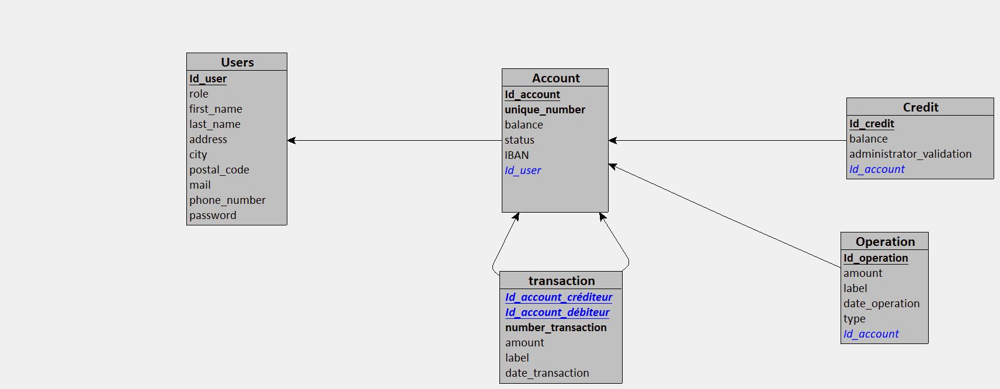
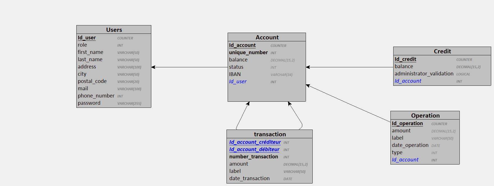

# BANK-ROUT

Vous êtes développeur junior au sein du service informatique d’une enseigne bancaire nommée Bank Root.

Le coeur de cible de cette banque était jusqu’à maintenant de proposer des services bancaires sur site.

Elle souhaite maintenant diversifier sa clientèle, entrer de plein pied dans l’ère du numérique ( kek …) et (ENFIN) proposer à ses usagers un service bancaire en ligne renouvelé afin d’attirer de nouveaux utilisateurs et moderniser son offre.

La mission de votre équipe est de concevoir une application qui permet à votre employeur la gestion de ses comptes bancaires en ligne dans un premier temps et dans un second temps de proposer des services de gestion bancaire à vos clients (dépôts, virements, etc …).

## Tables des matières

- [BANK-ROUT](#bank-rout)
  - [Tables des matières](#tables-des-matières)
  - [Instalation](#instalation)
  - [Règles métier](#règles-métier)
  - [Dictionnaire de données](#dictionnaire-de-données)
  - [MCD](#mcd)
  - [MLD](#mld)
  - [MPD](#mpd)
  - [UML](#uml)
    - [Diagrame Usecase](#diagrame-usecase)
    - [Diagrame de classe](#diagrame-de-classe)
    - [Diagrame séquentiel](#diagrame-séquentiel)
  - [Stratégie de sécurité](#stratégie-de-sécurité)

## Instalation

---

## Règles métier

**CLIENT**

- Lecture de son compte
- Peut demander la suppression de son compte
- Peut faire un virement vers un autre compte

**COMPTE**

- Posséder par un seul client
- On peut y déposer ou retirer une somme
- Page de transaction
- À un numéro unique

**ADMIN**

- est un banquier
- Peut voir un listing de tous les comptes
- Valide la suppression d'un compte
- Valide un crédit

---

## Dictionnaire de données

| Code mnémonique          | Désignation                                           | Type | Taille | Remarque   |
| ------------------------ | ----------------------------------------------------- | ---- | ------ | ---------- |
| unique_number_users      | numero unique du users                                | N    |        |            |
| first_name_users         | Prénom du users                                       | A    | 50     |            |
| last_name_users          | nom du users                                          | A    | 50     |            |
| address_users            | adresse du users                                      | AN   | 100    |            |
| city_users               | ville du users                                        | A    | 50     |            |
| postale_code_users       | code postal du users                                  | AN   | 20     |            |
| mail_users               | mail du users                                         | AN   | 100    |            |
| phone_number_users       | téléphone du users                                    | AN   | 12     |            |
| password_users           | mot de passe du users                                 | AN   | 255    |            |
| balance_credit           | la somme du crédit demandé                            | N    |        |            |
| administrator_validation | booléen pour savoir si la demande est accepté ou non  | Bool |        |            |
| balance_account          | montant du solde du compte                            | N    |        |            |
| unique_number_account    | numero unqiue                                         | N    |        |            |
| status_account           | status du coumpte, 1:ouvert, 2:en attente, 3:suprimer | N    |        |            |
| iban_account             | numero unique de banque                               | AN   | 34     |            |
| amount_operation         | montant de l'operation                                | N    |        |            |
| date_operation           | date de l'operation                                   | date |        | AAAA:MM:JJ |
| amount_transaction       | montant de la transaction                             | N    |        |            |
| date_transaction         | date de la transaction                                | date |        | AAAA:MM:JJ |
| label_transaction        | motif du virement                                     | AN   | 50     |            |

---

## MCD

---

## MLD

---

## MPD

---

## UML

### Diagrame Usecase

### Diagrame de classe

### Diagrame séquentiel

## Stratégie de sécurité

[Lien de la stratégie de sécurité.](./security/security.md)

---
